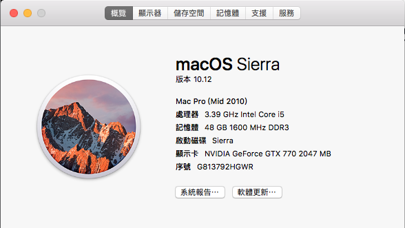

#[SUCCESS] Hakintosh OSX Sierra 10.12

##Hardware
###Motherboard: GIGABYTE
GA-Z77-DS3H (rev. 1.1)
[product link](http://www.gigabyte.com/products/product-page.aspx?pid=4326#ov)

###CPU
3.39 GHz Intel Core i5
###RAM
Kingstion DDR3 1600 16GB x 2
[product link ](http://24h.pchome.com.tw/prod/DRAC45-A9005BQ92) (zh_TW)

###HDD
 - 1
   - 容量(capacity)：	240.06 GB（240,057,409,536 byte）
   - 機型(model)：	SanDisk SDSSDX240GG25  
 - 2
   - 容量(capacity)：	480.1 GB（480,103,981,056 byte）
   - 機型(model)：	SanDisk SDSSDA480G         

###Video card
 - EVGA (NVIDIA GTX 770)
 - VRAM 2048 MB

##Instruction
###boot 
clover latest
###video 
EVGA GTX 770 (nvidia webdriver)
###sound 
Multibeast 887/889 current
###network 
(RTL8169 PCI card) 

``
sudo touch /System/Library/Extensions``
``sudo kextcache -update-volume /``

 
